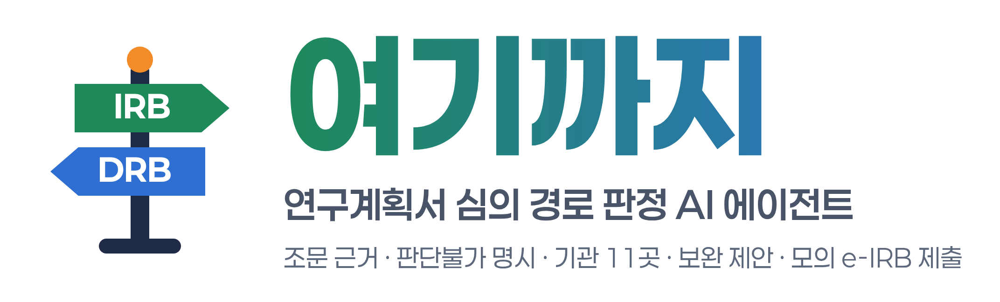
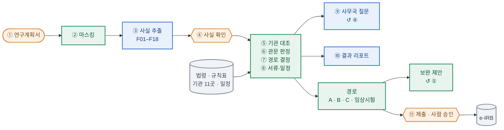
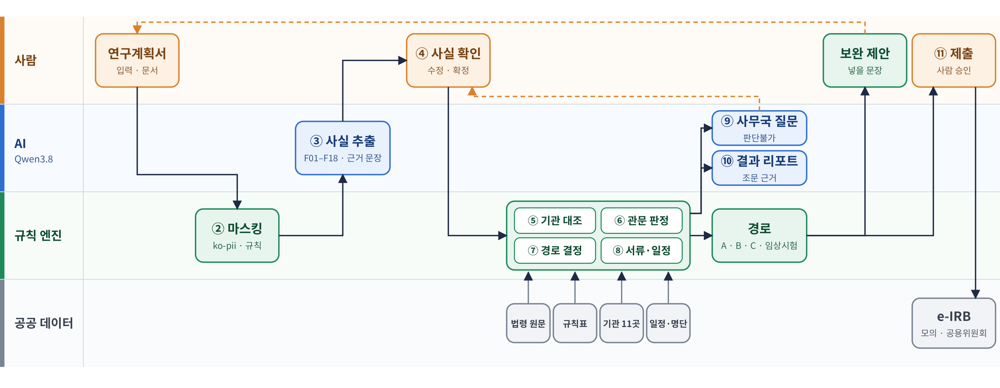

<div align="center">

<picture>
  <source media="(prefers-color-scheme: dark)" srcset="docs/banner-dark.png">
  
</picture>

### 연구계획서 심의 경로 판정 AI 에이전트

**연구계획서를 넣으면 기관 IRB · 공용위원회 · DRB · 임상시험 심사 중 어디에서 심의를 받아야 하는지 조문 근거와 함께 찾고, 빠진 항목에 넣을 문장과 서류 · 일정까지 정리합니다.**

[](#개발-기간)
[](https://www.python.org/)
[](https://streamlit.io/)
[](https://github.com/langchain-ai/langgraph)
[](https://huggingface.co/Qwen/Qwen3.8-27B-FP8)
[](tests/)
[](eval/README.md)

[왜 여기까지](#왜-여기까지) · [기능](#기능) · [구조도](#구조도) · [설치](#설치) · [빠른 시작](#빠른-시작) · [모의 e-IRB 제출](#모의-e-irb-제출) · [실제 e-IRB 채우기](#실제-e-irb-신청서-채우기-claude-in-chrome) · [평가](#평가) · [데모](#데모) · [로드맵](#로드맵) · [출처](#사용한-모델라이브러리데이터-출처)

</div>

---

**여기까지**는 연구자가 연구계획서를 넣으면 필요한 심의 경로, 서류 목록, 역산 일정을 조문 근거와 함께 제시하는 연구윤리 행정 에이전트입니다. 판정할 수 없는 항목은 추정하지 않고 '판단불가'로 표시해 사무국 질문이나 연구자 입력으로 넘깁니다.

판정은 규칙 엔진이 하고, AI(Qwen3.8, 로컬 GPU)는 계획서에서 사실을 뽑고 질문과 리포트를 쓰는 일만 합니다. 사람은 뽑힌 사실을 확인하고 제출을 승인합니다. 계획서와 모델은 서버 밖으로 나가지 않습니다.

> 본 에이전트는 심의 결과를 예측하거나 승인 여부를 판정하지 않습니다. 산출물은 연구자가 사무국에 확인할 항목을 정리한 초안입니다.

## 왜 여기까지

| | 여기까지 | 범용 LLM 상담 |
|---|---|---|
| 판정 | 규칙 엔진이 조문 조건으로 판정 | 모델이 문장으로 답함 |
| 근거 | 판정 행마다 규칙 ID · 법령 · 조문 원문 · 확인일 | 출처를 따로 확인해야 함 |
| 모르는 것 | 판단불가로 표시해 사무국 질문 · 연구자 입력으로 넘김 | 그럴듯하게 채워 답할 수 있음 |
| 기관 차이 | 기관 11곳의 규칙 · 계획서 서식 · 서류 · 일정을 데이터로 대조 | 일반적인 설명 |
| 개인정보 | 이름 · 연락처를 가린 뒤 로컬 GPU에서 추출 | 외부 API면 계획서가 밖으로 나감 |
| 다음 행동 | 넣을 문장 · 서류 목록 · 역산 일정 · 제출 준비 | 설명으로 끝남 |

## 기능

- **심의 경로**: A 가명 데이터 → DRB + IRB · B 공용기관생명윤리위원회 · C 소속 기관 IRB · 임상시험(식약처 승인 + 실시기관 심사위원회) · 범위 밖 · 미정
- **조문 근거**: 판정 행마다 규칙 ID, 법령 · 조문, 원문, 확인일을 붙입니다.
- **판단불가**: 추정하지 않습니다. (가) 위원회가 판단할 사항은 사무국 질문으로, (나) 계획서에 없는 정보는 연구자 입력으로 넘기고 ④부터 다시 판정합니다.
- **기관 층**: 기관 11곳의 규칙 · 계획서 서식 · 제출 서류 · 심의 일정을 `data/institutions/profiles/`에 데이터로 둡니다. 기관을 늘리려면 파일 하나를 더합니다.
- **제출 전 보완**: 빠진 항목에 넣을 문장을 제안합니다. 연구자가 빈칸을 채워 넣으면 처음부터 다시 판정합니다.
- **제출 준비**: 조건을 넘으면 모의 e-IRB에 채우고 최종 제출 앞에서 멈춥니다. 제출처가 공용위원회면 실제 e-IRB 신규 심의 신청 화면을 여는 링크를 둡니다.

## 구조도



<sub>색: 주황 사람 · 파랑 AI(Qwen3.8) · 초록 규칙 엔진 · 회색 공공 데이터. ↺는 사람이 고친 뒤 그 단계부터 다시 도는 고리입니다(보완 문구로 계획서 수정 → ①, 판단불가 항목 입력 → ④).</sub>



<sub>역할별 흐름. 판정은 규칙 엔진만 합니다. AI는 계획서에서 사실을 뽑고 사무국 질문과 리포트를 씁니다. 사람은 뽑힌 사실을 확인하고 제출을 승인합니다. 주황 점선은 사람이 고쳐서 다시 도는 고리입니다.</sub>

① 입력(사람) → ② 개인정보 마스킹(규칙) → ③ 사실 추출(AI) → ④ 사실 확인(사람) → ⑤ 기관 대조 → ⑥ 관문 판정 → ⑦ 경로 결정 → ⑧ 서류·일정(규칙) → ⑨ 판단불가 처리 → ⑩ 결과 리포트(AI) → ⑪ 제출 준비(사람 승인)

- ④에서 연구자가 사실을 확정해야 판정이 시작됩니다.
- 계획서에 정보가 없는 항목은 연구자에게 입력을 받아 ④부터 다시 판정합니다.

## 설치

파이썬 3.10이 필요합니다.

```bash
git clone https://github.com/mself8/irb-route-agent.git
cd irb-route-agent
python -m venv .venv && source .venv/bin/activate
pip install -r requirements.txt
```

## 빠른 시작

```bash
FAKE=1 streamlit run app.py   # 예시 모드: 샘플 결과로 화면만 봅니다 (모델 서버 없이)
FAKE=0 streamlit run app.py   # 실제 모드: ③ 사실 추출에 모델 서버가 필요합니다
pytest                        # 약속 검사
```

실제 모드는 OpenAI 호환 API로 Qwen3.8을 부릅니다. 주소와 모델 이름은 `LLM_BASE_URL`(기본 `http://127.0.0.1:8000/v1`)과 `LLM_MODEL`(기본 `qwen3.8-27b`)로 바꿉니다.

```bash
vllm serve Qwen/Qwen3.8-27B-FP8 --served-model-name qwen3.8-27b --port 8000   # 예: 로컬 GPU에서 vLLM으로
```

## 모의 e-IRB 제출

⑪ 제출 도우미는 모의 e-IRB(실제 기관과 무관)에 칸을 채우고 최종 제출 앞에서 멈춥니다. 사람이 캡처와 입력값을 보고 승인하면 제출하고 접수번호를 받습니다.

```bash
python -m playwright install chromium-headless-shell   # 처음 한 번 (브라우저)
python demo/mock_eirb/server.py                        # 모의 e-IRB: http://127.0.0.1:8765 (데모 계정 demo/demo)
FAKE=0 streamlit run app.py                            # 결과 화면 → "제출 준비 (모의 e-IRB)"
```

제출 도우미는 http(s)://127.0.0.1 · localhost만 조작합니다. 브라우저에 쓸 수 없는 프록시를 걸어, 그 밖으로 나가는 요청(리다이렉트 · 새 창 · 웹소켓 포함)은 모두 실패합니다. 캡처와 첨부 사본은 `/tmp/nais_*`에만 둡니다. 제출처가 공용위원회면 제출 화면에 실제 공용위원회 e-IRB 신규 심의 신청 링크를 둡니다. 링크는 열기만 하고, 로그인 · 동의 · 서약 · 최종 제출은 연구자 본인이 합니다.

## 실제 e-IRB 신청서 채우기 (Claude in Chrome)

제품은 실제 기관 사이트를 조작하지 않습니다. 데모 영상에서 실제 e-IRB 신청서를 채운 것은 Anthropic의 브라우저 확장 **Claude in Chrome**입니다. 아래처럼 각자 환경에서 따라 할 수 있습니다. 로그인 · 동의 · 서약 · 파일 첨부 · 저장 · 최종 제출은 언제나 연구자 본인이 합니다.

**준비**

1. Chrome에 Claude in Chrome 확장 프로그램을 설치하고, 본인 Claude 계정으로 로그인합니다. 계정 요금제에 따라 쓸 수 있는지 먼저 확인하세요.
2. 여기까지 앱에서 계획서를 판정하고 보완합니다.
3. 제출 준비 화면의 "공용위원회 e-IRB에서 신규 심의 신청하기"를 눌러, 새 탭의 e-IRB에 본인 계정으로 로그인합니다.

**방법 1 · 옆 패널에서 시키기 (계획서 · 기관이 달라도 됨)**

확장 프로그램 옆 패널에 아래처럼 요청합니다. Claude가 두 탭을 읽고 칸마다 판단해 채웁니다. 몇 분 걸리고, 중간에 허락을 물으면 확인해 주면 됩니다.

```text
'여기까지' 탭의 개선된 연구계획서를 읽고, 이 e-IRB 신규 심의 신청 화면을 채워 줘.
계획서에 근거가 없는 칸은 비워 두고, 동의 · 서약 체크, 파일 첨부, 저장 · 제출 버튼은 누르지 마.
```

**방법 2 · 기관 대응표로 빠르게 (공용위원회, 약 30초)**

영상에 쓴 방식입니다. [`demo/eirb_fill/`](demo/eirb_fill/)의 표준 신청 데이터, 공용위원회 대응표, 범용 채우기를 스크립트 하나로 묶습니다. 그다음 Claude Code(Chrome 연동)에게 e-IRB 탭에서 그 스크립트를 실행하게 합니다.

```bash
python demo/eirb_fill/build_fill.py 개선된_계획서.txt   # 근거 문장이 계획서에 있는 값만 넣은 demo/eirb_fill/run_fill.js
```

칸 ID가 아니라 화면의 칸 이름과 선택지 글자로 칸을 찾습니다. 못 찾거나 둘 이상 맞으면 건너뛰고 사람 확인으로 남깁니다. 다른 기관은 대응표 파일 하나를 더하면 됩니다.

**주의**

- 브라우저 창을 화면 앞에 두세요. 가려진 탭에서는 사이트가 양식을 다 그리지 않습니다.
- 사이트가 잠근 칸(예: 공용위원회 e-IRB의 위험수준)은 채워지지 않을 수 있습니다. 사람이 확인하세요.
- 실제 개인정보는 넣지 마세요. 데모 계획서는 모두 가상입니다.

## 평가

평가용 합성 데이터(모두 가상 계획서, Claude Code로 생성)로 잽니다. 실제 계획서가 아니므로 정답은 법령·기관 원문 기준으로 따로 검증했습니다.

- **봉인 측정**: 함정 300(규칙마다 정면·다른 표현·부정문·경계값) + 대조군 93 + 합성 계획서 300. 1단계는 정답 사실로 규칙 엔진만(전수), 2단계는 층화 표본(함정 100 · 합성 100)으로 AI 추출부터 끝까지 → `eval/results/standard_metrics.md`, 결함 목록 `eval/results/traps300_defects.md`
- **정답 역검증 693건**: Claude·GPT 두 계열이 원문만 보고 따로 채점 → `eval/results/crosscheck.md`
- **사람 표본 검수 40건**: 팀원이 판정 근거를 보며 맞음·틀림을 표시하는 페이지 → `eval/results/human_check40.html`

## 데모

- 데모 영상(제출물): 서울성모병원 CDW 샘플로 보완 후 모의 e-IRB 제출까지 · 공용위원회 샘플로 보완 후 실제 e-IRB 신청서 입력까지
- 실제 기관 사이트 입력 장면은 Claude in Chrome(Anthropic 브라우저 확장)이 한 것으로 제품 코드가 아닙니다. 로그인·동의·서약·파일 첨부·저장·제출은 사람이 하고, 영상에서는 저장·제출을 누르지 않았습니다.

## 로드맵

- **여기까지 크롬 확장 프로그램**: 사용자가 로그인한 기관 e-IRB 화면을 읽고, 기관 내부 LLM이 계획서와 서식 칸을 대응시켜 채웁니다. 사람이 확인한 대응은 기관 대응표로 쌓아, 다음부터는 바로 채웁니다. 지금은 Claude in Chrome으로 시연합니다.
- **API 서버와 웹 화면**: 화면이 부르는 `src/agent/api.py`의 함수(start · confirm · rejudge)를 FastAPI로 감싸고, 화면은 웹 프런트엔드로 옮깁니다. 모델은 기관 내부 GPU에 둡니다.
- **기관 확대**: 기관 프로필(규칙 · 계획서 서식 · 서류 · 일정)을 늘리고, 확인일이 지난 원문을 다시 대조합니다.
- **e-IRB 운영기관과 연동**: 표준 신청 데이터를 공식 API로 주고받습니다.
- **기관 계정과 기록 정책**: 기관 로그인, 기록 보관 · 삭제 기준을 둡니다.

## 폴더 구조

```
app.py              화면 시작점 (Streamlit)
src/ui/             화면: 입력 · 사실 확인 · 결과 · 판단불가 · 제출 준비
src/agent/          로직 (LangGraph)
  api.py            화면이 부르는 함수: start · confirm · rejudge · 제출 준비 · 승인
  state.py          화면과 로직이 주고받는 데이터 모양
  graph.py          ①~⑩ 연결 (④에서 멈춤)
  nodes/            ②③ 읽기 · ⑤~⑧ 판정 · ⑨⑩ 작성
  submit.py         ⑪ 제출 도우미 (모의 e-IRB만 조작)
data/               규칙표 · 기관 프로필 11곳 · 공공 명단 · 공개 일정 · 법령 원문 · 샘플 (data/README.md)
eval/               평가: 함정 300 · 대조군 93 · 합성 300 · 교차 채점 693 · 표준 지표 (eval/README.md)
demo/mock_eirb/     모의 e-IRB (127.0.0.1, 데모 계정)
demo/eirb_fill/     실제 e-IRB 신청서 채우기 도구 (데모용, 제품 코드 아님)
tests/              약속 검사 (pytest)
scripts/            샘플 결과 · README 배너와 그림 만들기
docs/               README 배너 · 그림
```

## 개발 기간

대회 규정에 따라 모든 개발은 본선 기간(2026-09-30 ~ 10-01) 안에 진행합니다. 이 레포는 본선 시작 전 README만으로 생성했습니다.

## 팀

이종현(대표) · 이진주 · 장다연 · 정송윤 · 김고은

## 사용한 모델·라이브러리·데이터 출처

본선 중 추가하는 대로 여기에 전량 기록합니다.

- AI 코딩 도구: Claude Code (Anthropic, Claude Opus 5.5) — 코드·테스트·문서 작성 전반. 개발자(송윤)가 지시하고 검토했으며, 세션 2개가 나눠 맡았다(규칙 엔진·화면 / 추출·마스킹·평가). 커밋마다 별도 Claude 리뷰 에이전트가 검토했고, 커밋 메시지에 Co-Authored-By로 표기
- 화면 코드 생성형 AI: OpenAI Codex CLI (OpenAI, https://github.com/openai/codex, Apache-2.0) — 본선 중 팀원(화면 담당)이 `src/ui/` 화면·글꼴·문서 불러오기 작업에 사용하고 직접 검토했다. 모델은 Astra(2026-10-01 기준 최신, 팀원 확인)
- 기획 단계 생성형 AI: OpenAI Codex CLI — 참가신청서를 바탕으로 한 초기 구조도 초안(본선 전). 발표자료·목업 이미지에 쓴 도구는 제출 전 팀이 확인해 추가
- 평가 정답 독립 채점: 합성 계획서·함정 693건(모두 가상)의 정답을 두 계열이 법령 원문만 보고 따로 달았다 — Claude 서브에이전트(Claude Opus 5.5)와 OpenAI Codex CLI 0.159.2(gpt-6.1-sol). 가상 계획서만 보냈고 실제 개인정보는 없다(`eval/crosscheck.py`, `eval/results/crosscheck*`)
- 데모 영상의 실제 기관 사이트 장면: Claude in Chrome(Anthropic 브라우저 확장)이 공용기관생명윤리위원회 e-IRB 신규 심의 신청 화면에 우리 결과(가상 샘플 계획서)를 채운 것이다. 제품 코드가 아니며, 저장·제출은 누르지 않았다. 로그인(동의한 팀원 본인 계정)·동의·서약·파일 첨부·최종 제출은 사람이 한다
- 라이브러리: Streamlit 1.64.0 (Apache-2.0), LangGraph 1.2.12 (MIT), Pydantic 2.13.5 (MIT), PyYAML 6.0.3 (MIT), pytest (MIT), OpenAI Python SDK 3.20.0 (Apache-2.0, vLLM의 OpenAI 호환 API 호출용), ko-pii 1.16.0 (MIT, https://github.com/Marker-Inc-Korea/ko-pii, 규칙 기반 개인정보 검출 — ② 마스킹), Playwright for Python 1.63.0 (Apache-2.0, https://github.com/microsoft/playwright-python) + Chromium Headless Shell 153 (BSD-3-Clause, Playwright 배포 v1243) — ⑪ 제출 도우미가 모의 e-IRB(`demo/mock_eirb`, 127.0.0.1)만 조작, pypdf 6.10.0 (BSD-3-Clause, https://github.com/py-pdf/pypdf) — S1 문서 불러오기의 PDF 텍스트 추출
- UI 글꼴: Paperlogy 1.000 (PT&, SIL OFL 1.1, https://freesentation.blog/paperlogyfont). 사용자 제공 TTF를 WOFF2로 압축해 포함(`src/ui/fonts/`, OFL.txt 동봉). 변환 도구: FontTools 4.61.1 (MIT, https://github.com/fonttools/fonttools), Brotli 1.2.0 (MIT, https://github.com/google/brotli)
- 시연용 공개 주소: Cloudflare Tunnel cloudflared 2026.9.3 (Apache-2.0, https://github.com/cloudflare/cloudflared)의 임시 주소(trycloudflare.com)로 GPU 서버의 앱(실제 모드)을 연다. 로그인이 없어 시연하는 동안만 켠다. 계획서와 모델은 서버에 그대로 있고, 주소는 화면만 중계한다
- 데모 영상(제출물): 실제 모드(FAKE=0) 화면을 Playwright for Python 1.63.0으로 녹화하고, FFmpeg 7.0.2 (GPL 빌드, imageio-ffmpeg 0.6.0 배포본, https://github.com/imageio/imageio-ffmpeg)로 AI 대기 구간을 잘랐다. 잘라 낸 자리에 생략한 초를 적은 자막은 Pillow 12.3.0 (MIT-CMU, https://python-pillow.org)과 Noto Sans CJK KR (SIL OFL 1.1, https://github.com/notofonts/noto-cjk)으로 그렸다. 샘플은 `data/samples/real1_cdw_cmc.json`, 제출은 로컬 모의 e-IRB에만 했다
- 공용위원회 e-IRB 데모 영상(제출물): macOS 기본 화면 기록으로 실제 모드 앱(Qwen3.8)과 공용위원회 e-IRB 화면을 찍고, FFmpeg 7.0.2 (GPL 빌드, imageio-ffmpeg 0.6.0 배포본)로 AI 대기·로딩 구간을 자르고 2~3배속했다(화면에 배속·생략 표시). 자막은 Pillow 12.3.0과 Noto Sans CJK KR로 그렸다. 샘플은 가상 계획서, e-IRB 입력은 Claude in Chrome(제품 코드 아님)이고 저장·제출은 하지 않았다
- LLM: Qwen3.8-27B-FP8 (Qwen, Hugging Face `Qwen/Qwen3.8-27B-FP8`, 리비전 017b9c7, Apache-2.0)
- LLM 서빙: vLLM 0.25.1 (Apache-2.0), 로컬 GPU(RTX A6000 2장). 계획서가 서버 밖으로 나가지 않습니다.
- 법령 원문 (국가법령정보센터 law.go.kr, 확인일 2026-09-29): 생명윤리 및 안전에 관한 법률·시행령·시행규칙, 개인정보 보호법·시행령, 약사법, 의약품 등의 안전에 관한 규칙, 의료기기법·시행규칙, 공용기관생명윤리위원회 고시. 정리본은 `data/laws/` (본선 전 수집)
- 근거 검색(RAG): `src/agent/retrieve.py` — `data/laws/`를 조문·소제목 단위로 나눠 글자 2-gram BM25로 찾음(직접 구현, 외부 검색 라이브러리·임베딩 모델 없음). 판정에는 쓰지 않고 ⑨ 사무국 질문의 참고 근거와 근거 보기에만 씀
- 가이드라인: 가명정보 처리 가이드라인 2026.03. (개인정보보호위원회, https://www.pipc.go.kr/np/cop/bbs/selectBoardArticle.do?bbsId=BS217&mCode=G010030000&nttId=11931, 확인일 2026-09-30), 보건의료데이터 활용 가이드라인 2025.12 (보건복지부·개인정보보호위원회, https://www.mohw.go.kr/boardDownload.es?bid=0003&list_no=1488471&seq=1), 공용기관생명윤리위원회 운영기관 안내 (https://public.irb.or.kr/), AI Hub 안심존 공용 기관생명윤리위원회(IRB) 심의신청 가이드라인 v3.2 (팀 문서 인용, 2차 출처 — R-11 제출 전 보완 경고의 근거)
- 판정 규칙표(`data/rules/rules.yaml`)의 원문은 팀이 본선 전(09-29)에 모은 사전 조사 자료에서 옮겼습니다.
- 공개 심의 일정: 공용기관생명윤리위원회 2026 심의일정 103회 (`data/schedules/public_irb_2026.csv`, e-IRB 심의일정 달력 https://public.irb.or.kr/pt/pt01/PT0103/PT0103R05.do, 확인일 2026-09-29, 본선 전 수집). 접수 마감은 공용위원회 SOP ver5.5 제31조④(심의 7일 전까지 접수)로 계산
- 기관 층(`data/institutions/standard.yaml` + 기관별 `data/institutions/profiles/<id>.yaml`, 조사 기록 `data/institutions/notes/`, 일정 `data/schedules/<id>_irb_2026.csv`). 각 기관이 공개한 안내문에서 서류 이름·규칙 요지·일정 같은 사실만 옮기고 원문 파일은 넣지 않았다.
  - 본선 전 사전 조사(확인일 2026-09-29): 공용기관생명윤리위원회 e-IRB 제출서류 안내·SOP ver5.5·연구계획서 권고서식 제32~34·37호 (https://public.irb.or.kr/), 서울시립대학교 생명윤리위원회 표준운영지침 Ver.2.3·FAQ v3·R-BAY 공지·2026 정규심의 일정 (https://r-bay.co.kr/agency/main/QzMzZ2NYdTVrbHUza0lxZG9ZcE40QT09, https://research.uos.ac.kr/institutionalbioethicscommittee), 가톨릭중앙의료원 CMC 임상연구윤리규정집 Ver.10.0 별표1·신규과제 유의사항·심사면제 절차 안내·개인정보 관련 IRB 심의 안내 (https://cmcirb.cmcnu.or.kr/), 질병관리청 IRB 표준운영지침 개정 내용 소개 (PHWR 2026;19(5):268, CC BY 4.0, https://doi.org/10.56786/PHWR.2026.19.5.3)
  - 본선 중 조사(확인일 2026-09-30, 공개 페이지만): 세브란스병원 임상연구보호센터 IRB 안내·2026 심의 일정·연세대학교 의료원 개인정보처리방침 (https://ocr.yuhs.ac/HPC/Sinchon/IRB/IrbReviewType), 삼성서울병원 IRB 제출서류 안내·심사비·공지 (https://r-bay.co.kr/agency/main/OVJlRFdsQmpiaGhhdmprTllzR1Z1QT09), 경희대학교병원 IRB — 경희대병원 IRB 공지(초기심의·심의면제 제출서류 안내, 2026년도 정규심의 일정, SOP Ver.9.5·9.6·9.7 개정 안내, 심사비 안내, 심의 접수 서류 검토 안내) · 경희의료원 임상의학연구소 IRB 소개 (https://r-bay.co.kr/agency/main/czNmb3IxZ2F4NUZwQmplaVVGY29Odz09 · https://www.khmc.or.kr/kr/research-education/research-institution/cri_organization1.do, 확인 2026-09-30), 고려대학교 안암병원 IRB — 고려대의료원 임상연구윤리센터 IRB 소개·심사접수료 (https://www.kumc.or.kr/kr/institution/hrpc/IRB.do) · 안암 연구중심병원 IRB 소개·심의 절차도 (https://anamrnd.kumc.or.kr/kr/reserch-support/irb.do) · 임상연구지원실 뉴스레터 26.05 · STEP 2026 생명윤리교육 안내 (확인 2026-09-30), 가톨릭대학교 성심교정 생명윤리심의위원회 — 가톨릭대 IRB사무국 공지 「★[필독]★ 신규심의 서류 작성 시 유의사항」(2025-03-14, 2026-09-22 최종 수정)·「2026년도 월별 신규심의 접수기간」(2026-01-16, 04-16 수정)·「2026년 11월 신규심의 & 심의면제 접수기간 안내」(2026-09-29)·「2차 자료 사용 심의면제 신청서식 및 제출 서류 목록 변경 안내」·심의안내(심의일정·신청방법·제출서류·면제대상)·서식 ver.3.8(2026-07-28 승인) (https://irb.catholic.ac.kr/irb/notice/notice.do?mode=view&articleNo=258944, https://irb.catholic.ac.kr/irb/guide-deli/documents_submitted.do, 확인 2026-09-30)
- 실제 연구 비교 자료: CRIS(임상연구정보서비스, 질병관리청) 공개 등록 연구 8건 — seq 29626·29627·29675·29685·29703·29714·29814·29826 (https://cris.nih.go.kr/cris/search/detailSearch.do?seq=번호, 확인일 2026-09-30). 연구책임자 성명 등 개인정보는 빼고 연구 요약만 입력으로 쓰며, 승인 위원회와 관할 유형만 비교한다(`data/cases/cris/`)
- 평가용 가상 계획서 10건(`data/cases/`): 팀이 만든 가상 자료, 정답은 T3 확인 전 초안
- 개발용 함정 32건·대조군 10건(`eval/traps/traps.yaml`): 규칙을 고치는 데 쓴 가상 자료. 규칙을 지킨 대조군에서 한 문장만 바꿔 규칙을 어기게 만들었고, 기관 규정 함정은 그 기관이 공개한 규정(`data/institutions/profiles/`)을 뒤집었다
- 평가용 합성 계획서·함정 600건: Claude Code로 생성(생성 규칙·시드 20260930 공개). 합성 계획서 300건(`eval/synth/`)은 시나리오로 만들고 정답 경로는 사전 판정규칙표의 결정 순서로 적었다. 일부(약 80건)는 CRIS 공개 등록 연구 8건 요약을 변형(seq 29626·29627·29675·29685·29703·29714·29814·29826). 함정 300건·대조군 93건(`eval/traps/generate.py`)은 규칙마다 정면 위반·다른 표현·부정문·경계값으로 만들고 정답은 법·기관 원문 기준으로 적었다. 모두 가상이고 정답은 T3 확인 전 초안이며, 기능 동결(02:00) 뒤에 코드로만 쟀다
- 데이터: `data/samples/`의 계획서 7건과 `data/lists/demo_institutions.csv`의 기관은 가상 자료입니다. 기능 확인용 짧은 계획서 4건은 팀이 만들었고, 데모 화면의 실제형 계획서 3건(`real1_cdw_cmc`·`real2_chart_khmc`·`real3_survey_cuk`)은 Claude Code로 각 기관의 계획서 서식 항목(위 기관 층 출처)에 맞춰 썼습니다. 인물·연락처·연구 내용은 모두 지어낸 것입니다. 공공 데이터는 추가하는 대로 URL과 확인일을 적습니다.
